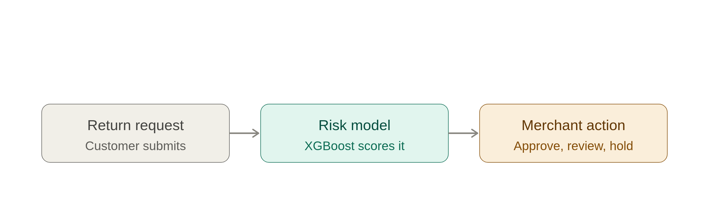

# Return Risk Scorer

**Built for Razorpay AI Buildathon 2026 — Track 02: AI Risk Manager**

> Stop the merchant losing money to return abuse — a risk scorer that flags likely return abuse (wardrobing, serial returners, policy gaming) before the refund goes out, using a customer's order history and the return's details.

🔗 **Live demo:** [razorpay-return-risk-scorer.streamlit.app](https://razorpay-return-risk-scorer-npcksttannra2m5auekmfq.streamlit.app/)

---

## Table of Contents

- [Problem](#problem)
- [Solution](#solution)
- [Architecture](#architecture)
- [Results](#results)
- [Project Structure](#project-structure)
- [Setup — Run Locally](#setup--run-locally)
- [Setup — Use Your Own Data](#setup--use-your-own-data)
- [Tech Stack](#tech-stack)
- [Data & Honesty Notes](#data--honesty-notes)
- [Limitations & Next Steps](#limitations--next-steps)

---

## Problem

Merchants lose money to return abuse — customers who wear an item once and return it ("wardrobing"), or repeatedly exploit return policies. Most merchants have no fast way to tell an honest return from abuse at the moment the request comes in, so they either investigate everything (expensive, slow) or nothing (expensive, differently).

## Solution

A model that scores every return request **Low / Medium / High risk** using only information the merchant already has at request time — return history, account age, order value, item category — and returns a recommended action:

| Risk | Recommendation |
|---|---|
| 🟢 Low | Auto-approve refund |
| 🟡 Medium | Flag for human review |
| 🔴 High | Hold refund, request more info |

## Architecture

```
Return request → Risk model (XGBoost) → Score + action (approve / review / hold)
```



1. **Return request** — customer submits a return with order and item details
2. **Risk model** — the noise-adjusted XGBoost model scores it using only pre-decision-time features (no investigation-only signals)
3. **Merchant action** — score maps to a recommendation: auto-approve, flag for review, or hold pending more info

The model never auto-executes an irreversible action — medium/high-risk cases always route to a human for the final call.

## Results

Evaluated on a 12,000-row held-out test set the model never saw during training:

| Metric | Score |
|---|---|
| Precision (Risky class) | 94% |
| Recall (Risky class) | 87% |
| Overall accuracy | 94% |

**Confusion matrix**

| | Predicted Honest | Predicted Risky |
|---|---|---|
| **Actually Honest** | 7,972 | 210 (false alarm) |
| **Actually Risky** | 479 (missed) | 3,339 (caught) |

**False-positive cost analysis** (illustrative cost assumptions, stated explicitly — not measured from real merchant data):

| | Count | Est. cost/case | Est. total |
|---|---|---|---|
| False alarms (honest, flagged) | 210 | ~$3 support cost | ~$630 |
| Missed abuse | 479 | ~$150 avg refund | ~$71,850 |
| Abuse correctly caught | 3,339 | ~$150 avg refund saved | ~$500,850 |

Full breakdown, live scoring, and real test-set examples (including mistakes) are in the [live demo](https://razorpay-return-risk-scorer-npcksttannra2m5auekmfq.streamlit.app/).

## Project Structure

```
razorpay-return-risk-scorer/
├── app/
│   └── app.py                  # Streamlit demo (4 tabs: Problem, Performance, Live, Reality check)
├── models/
│   ├── return_risk_model.pkl   # trained XGBoost model
│   ├── model_columns.json      # exact feature columns/order the model expects
│   ├── category_options.json   # dropdown values for the demo UI
│   └── model_vs_reality.csv    # sample held-out predictions vs actual labels
├── notebooks/
│   ├── 01_data_cleaning.ipynb
│   ├── 02_feature_engineering.ipynb
│   └── 03_model_training.ipynb
├── data/
│   ├── raw/                    # place source CSV here (gitignored)
│   └── processed/              # cleaned/engineered data (gitignored)
├── requirements.txt
└── README.md
```

## Setup — Run Locally

**Prerequisites:** Python 3.9+, pip

```bash
# 1. Clone the repo
git clone https://github.com/<your-username>/razorpay-return-risk-scorer.git
cd razorpay-return-risk-scorer

# 2. (Recommended) Create a virtual environment
python3 -m venv venv
source venv/bin/activate      # Windows: venv\Scripts\activate

# 3. Install dependencies
pip install -r requirements.txt

# 4. Run the demo app
streamlit run app/app.py
```

The app will open at `http://localhost:8501`. It loads the pre-trained model from `models/` — no training needed to try the demo.

> **Note:** On some older CPUs (pre-AVX instruction set), `pandas`/`numpy`/`xgboost` can crash with `Illegal instruction (core dumped)`. If you hit this, either run `export OPENBLAS_CORETYPE=Nehalem` before launching, or use a cloud notebook (Google Colab) instead of running locally.

## Setup — Use Your Own Data

To retrain on your own return/order data instead of the sample dataset:

1. **Prepare your CSV** with (at minimum) these columns — matching names, or adjust the notebook code to your names:
```
   age, account_age_days, customer_segment, country, platform, device_type,
   payment_method, product_category, avg_order_value_usd,
   refund_amount_requested_usd, is_high_value_item, discount_used,
   days_to_return, return_reason, shipping_carrier,
   total_orders_lifetime, total_returns_lifetime,
   wishlist_to_cart_time_hrs, <your_target_column>
```
2. Place it in `data/raw/your_file.csv`
3. Open `notebooks/01_data_cleaning.ipynb`, point the load path to your file, and run through cleaning
4. Run `notebooks/02_feature_engineering.ipynb` — **important:** re-check for data leakage on your own data. Drop any column that is a direct function of your target label, or that wouldn't be known at the moment a merchant receives the return request (see [Data & Honesty Notes](#data--honesty-notes) below for how we found ours).
5. Run `notebooks/03_model_training.ipynb` to train and save a new `return_risk_model.pkl` and `model_columns.json` into `models/`
6. Rebuild `category_options.json` from your own categorical columns' unique values
7. Restart the Streamlit app — it will pick up the new model automatically

## Tech Stack

- **Dataset:** [Kaggle — E-Commerce Return Abuse Detection Dataset](https://www.kaggle.com/datasets/sarveshchhetri/e-commerce-return-abuse-detection-dataset)
- **Model:** XGBoost (gradient-boosted trees)
- **Data processing:** pandas, scikit-learn
- **Demo UI:** Streamlit
- **Training environment:** Google Colab (CPU compatibility)
- **Deployment:** Streamlit Community Cloud

## Data & Honesty Notes

**Dataset:** [E-Commerce Return Abuse Detection Dataset](https://www.kaggle.com/datasets/sarveshchhetri/e-commerce-return-abuse-detection-dataset) (Kaggle, synthetic, 60,000 rows) — 35 features, labeled Legitimate / Policy Abuser / Fraudulent Return / Wardrobing.

During development we found the dataset's original labels were reproducible almost perfectly (~98%) by even a 3-question decision tree — a sign the labels were rule-generated rather than modeled on messy real-world behavior. We:

1. Identified and removed columns that leaked the label directly (e.g. a pre-calculated return-rate percentage highly correlated with the target)
2. Removed "investigation-time" columns a merchant wouldn't know at the moment of the return request (packaging condition, photo evidence, dispute count, etc.) to keep the feature set realistic
3. Injected controlled noise (feature noise + 5% label flips) to simulate real-world imprecision, since a model that hits ~100% on any dataset should be treated as a red flag, not a result

The 94%/87% precision/recall reported above is from this noise-adjusted, more realistic version — not the raw dataset's inflated ~100%.

## Limitations & Next Steps

- Trained on synthetic data, not a real merchant's transaction history — real-world precision/recall should be re-validated before production use
- Cost assumptions in the false-positive analysis ($3/$150 per case) are stated estimates, not measured — a real deployment should use the merchant's actual support and refund costs
- Next step for production: integrate as a webhook on the merchant's return-request event (e.g. via Razorpay), with the model providing a score that plugs into existing approval workflows rather than acting autonomously
